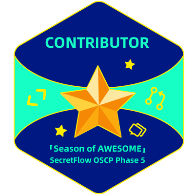

# Hi there 
# This is Hu Manyue from China!

Welcome to my Github page! I am a second-year graduate student majoring in Computer Science! 

[)](https://git.io/typing-svg)

## Languages and Tools 

## 🌱 Things I am currently working on: 
- Revise my first paper
- Practice coding and study algorithms
- Search for my first internship

## :muscle: Things I am challenging myself with:
- Waking up earlier to make good use of the day😄
- Exploring MultiModal Machine Learning🔭
- Finding new research ideas🤔

<!--   
   -->
   
   
   
   

<!--

-->
